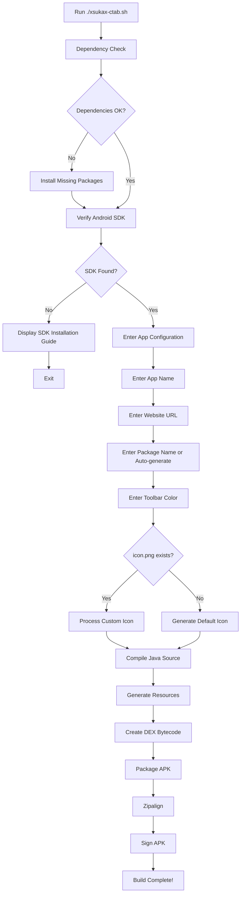
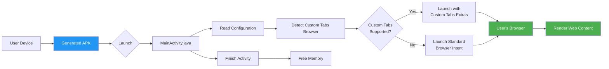

# xsukax Custom Tabs APK Builder

[](https://www.gnu.org/licenses/gpl-3.0)
[](https://www.debian.org/)
[](https://www.android.com/)

A lightweight, automated Bash script for building native Android APK applications that leverage Android's Custom Tabs API to deliver immersive, browser-based web experiences with minimal overhead.

## Project Overview

The xsukax Custom Tabs APK Builder is an intelligent automation tool designed for developers who need to rapidly deploy web applications as native Android apps without the complexity of traditional WebView implementations. This script eliminates the need for external dependencies by utilizing Android's built-in Custom Tabs framework, which provides hardware acceleration, modern browser features, and seamless integration with the user's preferred browser.

The tool automatically manages dependencies on Debian-based systems, handles Android SDK integration, processes custom icons, and produces production-ready APK files in a matter of seconds. The resulting applications are remarkably efficient, typically under 15KB in size, and open websites with aggressive UI optimization for a near-fullscreen, app-like experience.

**Key Capabilities:**
- Fully automated APK generation from simple user inputs
- Zero external library dependencies—pure Android Custom Tabs API
- Intelligent browser detection with fallback support
- Custom icon processing with multiple density support
- Minimal resource footprint and lightning-fast launch times
- Professional signing and alignment for distribution readiness

## Security and Privacy Benefits

This builder prioritizes security and user privacy through multiple architectural decisions:

### Native Android API Integration
The application exclusively uses Android's officially supported Custom Tabs API rather than embedding third-party browser engines or WebView components. This approach ensures that all web content is rendered by the user's trusted, regularly updated browser, inheriting all browser-level security patches and protections automatically.

### Minimal Permission Model
Generated APKs require only the `INTERNET` permission—no access to contacts, storage, location, camera, or other sensitive device resources. This minimal permission footprint reduces attack surface and respects user privacy expectations.

### No Data Collection or Tracking
The wrapper application contains no analytics, telemetry, or tracking mechanisms. It acts purely as a launcher that immediately transfers control to the user's browser and terminates, leaving no background processes or persistent data.

### Transparent Open Source Code
All generated application logic is visible in the script's Java template. Users and security auditors can verify exactly what code runs on their devices, with no obfuscation or hidden functionality.

### User-Controlled Browser Environment
By opening content in the user's chosen browser, the application inherits that browser's security features including ad blockers, password managers, anti-phishing protections, and privacy extensions. Users maintain full control over their browsing environment and security settings.

### Debug Keystore Signing
The script uses Android's standard debug keystore for development and testing purposes, making the signing process transparent and reproducible. For production releases, developers can easily integrate their own signing keys.

## Features and Advantages

### Automated Dependency Management
- Intelligent detection of missing system packages
- Interactive installation prompts for required tools (Java JDK, zip/unzip, wget)
- Optional dependency suggestions for enhanced functionality (ImageMagick, Python3)
- Compatibility checks for Debian-based distributions (Ubuntu, Debian, Linux Mint)

### Custom Tabs Optimization
- **Aggressive URL Bar Hiding:** Implements all available Custom Tabs flags to minimize browser UI
- **Fullscreen Immersive Mode:** Utilizes system UI flags for maximum content visibility
- **Instant Launch:** Zero-latency transition from app icon to web content
- **Browser Compatibility:** Prioritized support for Chrome, Edge, Brave, Samsung Internet, Firefox, and Opera
- **Seamless Fallback:** Automatically degrades to standard browser intent if Custom Tabs unavailable

### Professional APK Output
- Proper resource compilation with `aapt` (Android Asset Packaging Tool)
- DEX compilation with `d8` for optimal bytecode performance
- Zipalign optimization for faster installation and reduced RAM usage
- APK signing with debug or custom keystores
- Typical output size: 10-15KB (smaller than most icons)

### Developer-Friendly Workflow
- Interactive CLI prompts with sensible defaults
- Automatic package name generation from app name
- Hex color input for branded toolbar customization
- Support for custom launcher icons via `icon.png` file
- Comprehensive build status feedback with color-coded output

### Multi-Density Icon Processing
- Automatic scaling to mdpi, hdpi, xhdpi, xxhdpi, xxxhdpi densities
- ImageMagick integration for high-quality resampling
- Python-based PNG generation for default icons
- Fallback binary PNG for maximum compatibility

## Installation Instructions

### System Requirements
- **Operating System:** Debian-based Linux distribution (Ubuntu 20.04+, Debian 11+, Linux Mint 20+)
- **Architecture:** x86_64 or ARM64
- **Disk Space:** ~500MB for Android SDK + build tools
- **Internet Connection:** Required for dependency installation

### Step 1: Download the Script

Clone the repository or download the script directly:

```bash
git clone https://github.com/xsukax/xsukax-Custom-Tabs-APK-Builder.git
cd xsukax-Custom-Tabs-APK-Builder
```

Alternatively, download the raw script:

```bash
wget https://raw.githubusercontent.com/xsukax/xsukax-Custom-Tabs-APK-Builder/main/xsukax-ctab.sh
chmod +x xsukax-ctab.sh
```

### Step 2: Install Android SDK

The script requires Android SDK command-line tools. Follow these steps:

1. **Download Android Command Line Tools:**
   ```bash
   wget https://dl.google.com/android/repository/commandlinetools-linux-11076708_latest.zip
   mkdir -p ~/Android/Sdk/cmdline-tools
   unzip commandlinetools-linux-*_latest.zip -d ~/Android/Sdk/cmdline-tools
   mv ~/Android/Sdk/cmdline-tools/cmdline-tools ~/Android/Sdk/cmdline-tools/latest
   ```

2. **Set Environment Variables:**
   ```bash
   echo 'export ANDROID_HOME=$HOME/Android/Sdk' >> ~/.bashrc
   echo 'export PATH=$PATH:$ANDROID_HOME/cmdline-tools/latest/bin:$ANDROID_HOME/platform-tools' >> ~/.bashrc
   source ~/.bashrc
   ```

3. **Install SDK Platform and Build Tools:**
   ```bash
   sdkmanager "platform-tools" "platforms;android-34" "build-tools;34.0.0"
   ```

4. **Accept Licenses:**
   ```bash
   sdkmanager --licenses
   ```

### Step 3: Verify Installation

Run the script for the first time to verify dependencies:

```bash
./xsukax-ctab.sh
```

The script will automatically detect and offer to install any missing dependencies including:
- Java Development Kit (OpenJDK 11 or 17)
- zip/unzip utilities
- wget or curl
- ImageMagick (optional, recommended)
- Python3 (optional, for icon generation)

## Usage Guide

### Basic Workflow

The script provides an interactive command-line interface that guides you through the APK creation process:



### Step-by-Step Execution

1. **Launch the Builder:**
   ```bash
   ./xsukax-ctab.sh
   ```

2. **Respond to Configuration Prompts:**

   **App Name:**
   ```
   App Name: My Awesome Website
   ```
   This becomes the application name displayed under the icon.

   **Website URL:**
   ```
   Website URL: https://example.com
   ```
   Must include protocol (http:// or https://).

   **Package Name (Optional):**
   ```
   Package Name (Enter for auto): 
   ```
   Press Enter to auto-generate from app name, or specify custom package (e.g., `com.mycompany.myapp`).

   **Toolbar Color:**
   ```
   Toolbar Color (hex, e.g., #2196F3): #FF5722
   ```
   Hex color code for the browser toolbar/status bar.

3. **Custom Icon (Optional):**
   
   Place a PNG image named `icon.png` in the same directory as the script before running:
   ```bash
   cp /path/to/your/icon.png ./icon.png
   ./xsukax-ctab.sh
   ```
   
   Recommended icon specifications:
   - Format: PNG with transparency
   - Size: 512x512 or 1024x1024 pixels
   - Content: Centered with padding, avoids sharp corners

4. **Build Process:**
   
   The script automatically handles:
   - Java source compilation
   - Resource generation and linking
   - DEX bytecode conversion
   - APK packaging and alignment
   - Debug signing

5. **Output Location:**
   
   The final APK is saved in a project-named directory:
   ```
   ./My_Awesome_Website/build/My_Awesome_Website.apk
   ```

### Architecture Overview



### Installation on Android Device

#### Method 1: USB Installation (Recommended)
```bash
adb install ./My_Awesome_Website/build/My_Awesome_Website.apk
```

#### Method 2: Manual Transfer
1. Copy the APK to your device via USB or cloud storage
2. Enable "Install from Unknown Sources" in Android Settings
3. Use a file manager to locate and tap the APK
4. Follow on-screen installation prompts

#### Method 3: Web Distribution
Upload to your web server and provide a direct download link. Users will need to enable installation from unknown sources.

### Advanced Configuration

#### Custom Signing Key (Production)

Replace the debug keystore with your release key:

```bash
# Generate release keystore
keytool -genkey -v \
    -keystore release.keystore \
    -alias release \
    -keyalg RSA \
    -keysize 2048 \
    -validity 10000

# Modify script to use release keystore
# Edit line ~570 in xsukax-ctab.sh:
# KEYSTORE="/path/to/your/release.keystore"
```

#### Batch Building

Create a configuration file for automated builds:

```bash
#!/bin/bash
# build-config.sh

export APP_NAME="My App"
export WEBSITE_URL="https://example.com"
export PACKAGE_NAME="com.example.myapp"
export TOOLBAR_COLOR="#2196F3"

# Run builder with input redirection
echo -e "$APP_NAME\n$WEBSITE_URL\n$PACKAGE_NAME\n$TOOLBAR_COLOR" | ./xsukax-ctab.sh
```

### Troubleshooting

**Issue: "Android SDK not found"**
- Verify `ANDROID_HOME` environment variable: `echo $ANDROID_HOME`
- Ensure SDK is installed at expected location
- Check that build-tools and platform directories exist

**Issue: "Compilation failed"**
- Verify Java JDK installation: `javac -version`
- Ensure Java 8+ is installed
- Check for syntax errors in auto-generated package name

**Issue: "APK not installing on device"**
- Enable "Install from Unknown Sources" in Android settings
- Verify minimum Android version (5.0 / API 21+)
- Check for conflicting package names with existing apps

**Issue: "Custom icon not applied"**
- Verify `icon.png` exists in script directory
- Check PNG is valid: `file icon.png`
- Ensure ImageMagick is installed for best results

## License

This project is licensed under the GNU General Public License v3.0, ensuring it remains free and open-source software for the community.

---

**Built with ❤️ by xsukax**  
Repository: [https://github.com/xsukax/xsukax-Custom-Tabs-APK-Builder](https://github.com/xsukax/xsukax-Custom-Tabs-APK-Builder)

**Contributions Welcome!** Issues, feature requests, and pull requests are appreciated.
